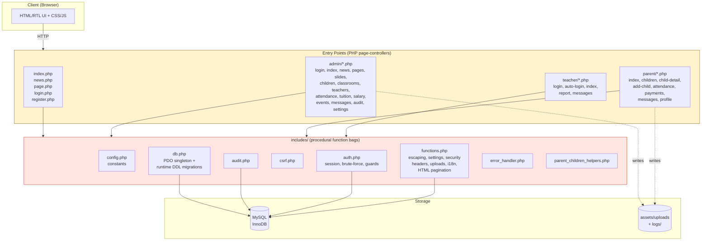

# ROMA — Enterprise Architecture Audit Report

**Project:** ROMA (Daycare Management System)
**Codebase:** `d:\roma-finaly\roma97` (PHP 8.x, no framework, procedural "page controller" architecture)
**Audit Date:** 2026-06-26
**Auditor Role:** Senior PHP Enterprise Architect
**Status:** Analysis only — no code modified

---

## Table of Contents

1. [Executive Summary](#1-executive-summary)
2. [Current Architecture Analysis](#2-current-architecture-analysis)
3. [Current Architecture Diagram](#3-current-architecture-diagram)
4. [Proposed Enterprise Architecture Diagram](#4-proposed-enterprise-architecture-diagram)
5. [Architectural Weaknesses](#5-architectural-weaknesses)
6. [Code Duplication Report](#6-code-duplication-report)
7. [Security Vulnerabilities](#7-security-vulnerabilities)
8. [Scalability Issues](#8-scalability-issues)
9. [Maintainability Issues](#9-maintainability-issues)
10. [Performance Bottlenecks](#10-performance-bottlenecks)
11. [Coupling Between Modules](#11-coupling-between-modules)
12. [Missing Abstraction Layers](#12-missing-abstraction-layers)
13. [Missing Service Layer & Repository Patterns](#13-missing-service-layer--repository-patterns)
14. [Missing Dependency Injection Opportunities](#14-missing-dependency-injection-opportunities)
15. [SOLID Principle Violations](#15-solid-principle-violations)
16. [Clean Architecture Violations](#16-clean-architecture-violations)
17. [Domain-Driven Design Violations](#17-domain-driven-design-violations)
18. [Refactoring Roadmap](#18-refactoring-roadmap)
19. [Technical Debt Report](#19-technical-debt-report)
20. [Risk Assessment Report](#20-risk-assessment-report)
21. [Scalability Assessment](#21-scalability-assessment)

---

## 1. Executive Summary

ROMA is a **PHP daycare-management application** written in a **procedural, page-controller style** with **no framework, no dependency container, no service layer, no repository pattern, and no domain model**. Every page is a single file that simultaneously acts as bootstrap, router, controller, validator, data-access layer, and view template.

The codebase demonstrates **solid operational hygiene in narrow areas** — parameterised SQL (PDO prepared statements with `ATTR_EMULATE_PREPARES => false`), `password_hash`/`password_verify`, CSRF tokens, brute-force throttling, security headers (CSP/HSTS/X-Frame-Options), XSS escaping via a central `e()` helper, and audit logging. These are commendable for a procedural project.

However, the architecture carries **systemic, enterprise-grade weaknesses** that make it brittle, hard to test, expensive to extend, and risky to scale:

| Dimension | Rating | Summary |
|---|---|---|
| Separation of concerns | 🔴 Critical | One file per page = bootstrap + controller + SQL + HTML |
| Abstraction layers | 🔴 Critical | No service/repository/domain layers; 171 SQL calls embedded in pages |
| Code duplication | 🔴 High | String-length helper in 7+ files; upload logic in 6+ files; 3 duplicated login flows |
| Testability | 🔴 Critical | Zero unit tests; global functions + `$_SESSION`/`$_POST` coupling |
| Security posture | 🟡 Moderate | Good primitives, but CSRF non-rotation, runtime DDL, default admin password seed |
| Scalability | 🔴 Critical | Runtime schema migrations + per-request table creation; no caching; no async |
| Maintainability | 🟡 Low–Med | Consistent coding style and escaping, but god-files and scattered SQL |
| Coupling | 🔴 High | Pages depend directly on PDO, session, `$_POST`, includes chain |

**Headline finding:** The single most damaging anti-pattern is the **"Smart Page"** — a PHP file that owns the entire request lifecycle including its own DDL migrations, validation, persistence, file I/O, and presentation. There are **171 embedded SQL statements** spread across **40+ page files** with **zero repository abstraction**, and **runtime `CREATE TABLE IF NOT EXISTS` calls execute on virtually every request**.

**Recommended target state:** A layered, PSR-4 autoloaded architecture with a dependency-injection container, domain entities/value objects, repository interfaces, application services, thin controllers, and a templating layer — ideally migrated incrementally onto a modern framework (Symfony or Laravel) or a structured ADR stack.

---

## 2. Current Architecture Analysis

### 2.1 High-level structure

The project is organised by **delivery channel** (public site, `admin/`, `parent/`, `teacher/`) rather than by **capability/bounded context**. Each channel has its own duplicated header/footer, login flow, and bootstrap sequence.

```
roma97/
├── config.php                 # Global constants (DB creds, SITE_URL, flags)
├── config.local.php.example   # Local override template
├── index.php                  # Public homepage (slides + news)
├── login.php / logout.php     # Parent auth entry points
├── register.php               # Parent self-registration
├── news.php / page.php        # Public CMS viewers
├── preflight.php              # Deployment health check
├── .htaccess
├── includes/                  # "Library": procedural function bags
│   ├── db.php                 # PDO singleton + runtime schema migrations (DDL)
│   ├── auth.php               # Session + brute-force throttle + auth guards
│   ├── csrf.php               # Single CSRF token (no rotation)
│   ├── audit.php              # Audit log writer (runtime table creation)
│   ├── functions.php          # GOD FILE: escaping, settings, security headers,
│   │                          #   uploads, Persian date/i18n, HTML pagination
│   ├── error_handler.php      # Custom error/exception/shutdown handlers
│   └── parent_children_helpers.php  # Parent-portal display helpers
├── templates/header.php / footer.php  # Public layout shell
├── admin/                     # Admin panel (page controllers + own header/footer)
├── parent/                    # Parent portal (page controllers + own header/footer)
├── teacher/                   # Teacher portal (page controllers + own header/footer)
├── assets/css|js|uploads      # Static assets + user uploads
└── logs/                      # File-based error log
```

### 2.2 Request lifecycle (current)

For a typical authenticated page (e.g. `admin/news.php`):

1. Page file `require_once`s `config.php`, `error_handler.php`, `auth.php`, `csrf.php`, `db.php`, `audit.php`.
2. `auth.php` starts a secure session at include time (side effect in a library file).
3. `requireLogin()` guards access.
4. Page calls `initializeCmsTables()` → **executes `CREATE TABLE IF NOT EXISTS` DDL on every request**.
5. On POST: manual `$_POST` extraction, CSRF check, validation with locally-defined helper (e.g. `newsStringLength()`), inline SQL `INSERT/UPDATE`, audit record, redirect.
6. On GET: inline `SELECT`, pagination, `require header.php` (emits `<html>`, nav, security headers), inline HTML with `e()` escaping, `require footer.php`.

### 2.3 Data model (inferred from DDL)

The schema is defined procedurally inside `includes/db.php` via `initializeXxxTables()` functions. Discovered entities:

- **Identity & access:** `admins`, `parents`, `teachers`, `login_throttle`, `login_tokens`
- **Childcare domain:** `children`, `classrooms`, `child_classroom`, `attendance`, `daily_reports`, `events`
- **CMS domain:** `settings`, `slides`, `news`, `pages`
- **Financial domain:** `tuition_payments`, `salary_payments`
- **Messaging domain:** `messages`
- **Operations:** `audit_log`

> ⚠️ The schema is the *de facto* source of truth and lives in PHP code, not in versioned migrations. There is no `.sql` file, no migration tool, and no schema snapshot.

---

## 3. Current Architecture Diagram



**Key observation:** Every page-controller has a **direct, unmediated dependency** on PDO (`includes/db.php`), `$_SESSION`, and `$_POST`. There is no intermediate layer. `functions.php` is a "god module" that touches escaping, settings, HTTP headers, file uploads, i18n, and HTML rendering simultaneously.

---

## 4. Proposed Enterprise Architecture Diagram

```mermaid
graph TB
    subgraph Client
        BROWSER[Browser / SPA]
    end

    subgraph Delivery["Delivery Layer"]
        KERNEL[HTTP Kernel / Front Controller<br/>PSR-7/15 middleware pipeline]
        ROUTER[Router]
        CTL[Thin Controllers<br/>Admin/Parent/Teacher/Public]
        PRESENTER[Presenter/Responder]
    end

    subgraph DI["Dependency Injection Container<br/>(PSR-11)"]
        CONTAINER[Container<br/>wires services, repositories,<br/>domain services, config]
    end

    subgraph Application["Application Layer (Use Cases)"]
        CMD[Command/Query Handlers<br/>CQRS-lite]
        SVC[Application Services<br/>AuthService, ChildService,<br/>AttendanceService, PaymentService,<br/>MessageService, ContentService]
        DTO[DTOs / Requests / Responses]
    end

    subgraph Domain["Domain Layer (pure PHP, no framework)"]
        ENT[Aggregates:<br/>Parent, Child, Classroom,<br/>Teacher, Attendance, Payment, Message]
        VO[Value Objects:<br/>Email, Money, DateRange,<br/>ChildId, AttendanceStatus]
        DSVC[Domain Services:<br/>EnrollmentPolicy,<br/>TuitionCalculator]
        DOMAIN_EVT[Domain Events]
        SPEC[Policies / Specifications]
    end

    subgraph Infrastructure["Infrastructure Layer"]
        REPO[Repository Implementations<br/>PDO-based, implement interfaces]
        UOW[Unit of Work]
        MAILER[Mailer]
        FS[Filesystem / Upload Storage]
        BUS[Event Bus / Dispatcher]
        LOG[Logger (PSR-3)]
        AUDIT_INFRA[AuditWriter]
        SEC[Security: CsrfGuard, RateLimiter,<br/>Hasher, SessionManager]
        THROTTLE[BruteForceThrottle<br/>Redis-backed]
    end

    subgraph Persistence
        MYSQL2[(MySQL via migrations)]
        REDIS[(Redis: cache,<br/>sessions, throttle)]
    end

    BROWSER --> KERNEL
    KERNEL --> ROUTER --> CTL
    CTL --> CMD --> SVC
    SVC --> ENT
    SVC --> REPO
    ENT --> DOMAIN_EVT --> BUS
    SVC --> DTO --> PRESENTER --> BROWSER

    DI -.wires.-> CTL
    DI -.wires.-> SVC
    DI -.wires.-> REPO

    REPO --> UOW --> MYSQL2
    SEC --> REDIS
    THROTTLE --> REDIS
    AUDIT_INFRA --> MYSQL2
    LOG --> FS

    style Domain fill:#e8f5e9,stroke:#2e7d32
    style Application fill:#e3f2fd,stroke:#1565c0
    style Infrastructure fill:#fff3e0,stroke:#e65100
    style Delivery fill:#f3e5f5,stroke:#6a1b9a
```

**Architecture style:** Layered + Hexagonal (Ports & Adapters) + DDD tactical patterns + CQRS-lite (command/query separation without separate stores).

**Key invariants of the target state:**
- The Domain layer has **zero** dependencies on PDO, `$_SESSION`, `$_POST`, or any framework.
- Repositories are **interfaces** defined in the Domain/Application layer, implemented in Infrastructure.
- Controllers are thin: they translate HTTP → command/query, invoke a handler, and return a response.
- All cross-cutting concerns (auth, CSRF, rate limiting, audit, logging, sessions) are **middleware**.
- A **DI container** wires everything; no `new` or `require_once` inside domain/service code.
- Schema changes ship as **versioned migrations** executed by a CLI tool, never at request time.

---

## 5. Architectural Weaknesses

### 5.1 "Smart Page" anti-pattern (Single-Responsibility collapse)
Every page file (e.g. `admin/news.php`, `register.php`, `teacher/report.php`) is simultaneously: bootstrap, router, controller, validator, upload handler, SQL repository, audit logger, and HTML view. `admin/news.php` (371 lines) is the canonical example — it defines `newsStringLength()`, `parseNewsId()`, `findNewsItem()`, `getAllNewsItems()`, `countNewsItems()`, `deleteNewsImage()`, `uploadNewsImage()`, `formatAdminNewsDate()`, handles POST, emits SQL, and renders the full HTML table + form.

### 5.2 No front controller / router
There is no single entry point. Each `.php` file is publicly routable. Routing is implicit in the filesystem layout. This prevents centralised middleware, consistent error handling, and uniform request enrichment.

### 5.3 No PSR-4 autoloading
Every file manually `require_once`s its dependencies. The include chain is fragile and order-dependent (e.g. `auth.php` requires `functions.php` and starts a session at include time — a side effect inside a library).

### 5.4 Side effects in library files
`includes/auth.php` calls `startSecureSession()` at file scope on include. `includes/error_handler.php` registers global handlers on include. Library inclusion should be side-effect-free; only explicit bootstrapping should mutate global state.

### 5.5 No domain model
There are no `Child`, `Parent`, `Teacher`, `Attendance`, `Payment`, or `Message` domain objects. Business rules (age calculation, enrollment status, tuition month uniqueness, attendance status transitions) are scattered as inline `match` expressions and ad-hoc SQL constraints across page files. Domain logic is not reusable, not testable, and not centrally governed.

### 5.6 No transactional boundaries
Multi-step writes (e.g. insert child + assign classroom + audit) are not wrapped in DB transactions. `admin/child-action.php` deletes then inserts `child_classroom` rows without a transaction — a crash mid-operation leaves orphaned classroom assignments.

### 5.7 Configuration via `define()`
`config.php` uses `define()` constants — global, immutable, untestable. There is no typed config object, no environment abstraction (beyond a local-PHP override), no secret management.

### 5.8 No abstraction over persistence
`getDb()` returns a raw `PDO` singleton. There is no `ConnectionInterface`, no query builder, no unit of work, and no way to swap the persistence backend for testing or scaling.

---

## 6. Code Duplication Report

### 6.1 Login flow ×3 (Critical duplication)
`admin/login.php`, `login.php`, and `teacher/login.php` reimplement the **same algorithm** with minor variable differences:
- CSRF validation
- IP + identifier brute-force pre-check
- Credential fetch + `password_verify`
- `session_regenerate_id(true)`
- `resetLoginAttempts()`
- `recordAudit('auth.login', ...)`

This is ~120 lines duplicated three times. A single `LoginService` / `AuthenticateUserCommand` could collapse it.

### 6.2 String-length helper ×7+
The exact function `function_exists('mb_strlen') ? mb_strlen(...) : strlen(...)` is redefined in:
- `register.php` → `registerStringLength()`
- `admin/news.php` → `newsStringLength()`
- `admin/slides.php` → `slidesStringLength()`
- `admin/pages.php` → `pagesStringLength()`
- `admin/settings.php` → `settingsStringLength()`
- `admin/events.php` → `eventsStringLength()`
- `parent/add-child.php`, `parent/profile.php` → similar variants
- `news.php`, `index.php` → inline `mb_strlen` + `mb_substr` truncation

### 6.3 Upload validation ×6+
Image-upload validation (size check, extension whitelist, `finfo` MIME check, `getimagesize()` verification, `move_uploaded_file`, random filename, chmod) is duplicated nearly verbatim in:
- `admin/news.php` → `uploadNewsImage()`
- `admin/slides.php` → `uploadSlideImage()`
- `admin/settings.php` → `uploadLogo()`
- `parent/add-child.php` → `uploadChildPhoto()`
- `parent/profile.php` → `uploadAvatar()`
- `admin/teachers.php` → avatar/certificate upload

`includes/functions.php` already has a `validateUploadSecurity()` helper that is **not used** by any of these — proving the duplication is accidental and the abstraction attempt failed to propagate.

### 6.4 Layout headers ×4
`templates/header.php`, `admin/header.php`, `parent/header.php`, and `teacher/header.php` each independently:
- `require_once` the same includes
- call `sendSecurityHeaders()`
- resolve `$currentPage = basename($_SERVER['PHP_SELF'])`
- emit `<!doctype html>`, `<head>`, font CDN link, stylesheet link
- render a nav with per-item active-state logic

The `<head>`, doctype, and asset-inclusion boilerplate is duplicated 4×.

### 6.5 Pagination table rendering
`renderPagination()` exists centrally in `functions.php`, but each list page (`admin/news.php`, `admin/pages.php`, `admin/slides.php`, `admin/children.php`, `admin/teachers.php`, `admin/events.php`, `admin/messages.php`, `parent/messages.php`) re-implements the surrounding "table + empty state + summary + pagination" HTML wrapper inline.

### 6.6 Age/gender/attendance display logic
`parent/index.php` **inlines** age calculation, gender label/icon, and attendance-status-badge rendering (lines 161–208) instead of using the helpers that already exist in `includes/parent_children_helpers.php` (`parentChildDisplayAge()`, `parentChildGenderLabel()`, `parentPortalAttendanceStatusLabel()`). The helpers were written but not adopted in the very file that should consume them.

### 6.7 Audit actor resolution
`currentAuditActor()` in `audit.php` and the `isLoggedIn()`/`isParentLoggedIn()`/`isTeacherLoggedIn()` family in `auth.php` both encode the same "which session role is active?" mapping — duplicated knowledge of session keys.

### 6.8 Bootstrap include sequence
Every page begins with the same 4–6 `require_once` lines. There is no `bootstrap.php` consolidating this.

---

## 7. Security Vulnerabilities

> Note: The project has **above-average security primitives** for a procedural PHP app — parameterised queries, password hashing, CSRF tokens, brute-force throttling, security headers, XSS escaping. The vulnerabilities below are **architectural** rather than trivial injection bugs.

### 7.1 🔴 HIGH — Default admin password seeded into the database
`includes/db.php` defines `DEFAULT_ADMIN_PASSWORD = 'admin123'` and `initializeDatabase()` seeds an `admin/admin123` account when the table is empty. While the app forces a password change on first login, this constant ships in source control. Anyone who reads the repo knows the bootstrap credentials, and `initializeDatabase()` runs on **every admin login page load**, so a wiped/admin-reset DB silently recreates a known-credential account.

### 7.2 🔴 HIGH — Runtime DDL / schema migrations execute at request time
`initializeParentTables()`, `initializeTeachersTables()`, `initializeFinancialTables()`, `initializeCmsTables()`, `initializeAuditTable()`, `initializeLoginThrottleTable()` run `CREATE TABLE IF NOT EXISTS` (and in `initializeTeachersTables()`, `ALTER TABLE ... ADD COLUMN` wrapped in `try/catch Throwable`) **on every request** that touches those features. This:
- Adds latency and metadata-lock contention under load
- Is non-idempotent in practice (the `ALTER` paths swallow exceptions to fake idempotency)
- Means a schema change cannot be reviewed, tested, or rolled back independently of code deploy
- Creates a race window where two concurrent requests both attempt DDL

### 7.3 🟡 MEDIUM — CSRF token never rotated
`includes/csrf.php` stores a single `$_SESSION['csrf_token']` and reuses it for the entire session. There is no per-request or per-form token, no "synchroniser token" rotation after login, and no expiry. A leaked token is valid until the session ends. Combined with `SameSite=Lax` cookies this is mitigated but not eliminated.

### 7.4 🟡 MEDIUM — Brute-force throttle fails open
`checkBruteForce()` and `recordFailedAttempt()` both wrap their logic in `try/catch (Throwable)` and **return `true` / silently no-op** on any failure. A DB outage disables rate limiting entirely, and there is no alerting. This is a deliberate availability trade-off but should at least log to a security channel and degrade to a stricter in-memory limiter.

### 7.5 🟡 MEDIUM — Session is started as a library side effect
`auth.php` invokes `startSecureSession()` at include scope. Any file that includes `auth.php` (including templates and login pages) implicitly starts a session before the controller runs. This makes it impossible to send headers conditionally and couples session lifecycle to file inclusion order.

### 7.6 🟡 MEDIUM — Mass assignment risk via unvalidated `$_POST` keys
Pages extract fields individually from `$_POST`, but there is no allow-list layer. A page that copies `$_POST` wholesale into an INSERT (none currently do, but the pattern invites it) would enable mass assignment. The lack of a DTO/form layer makes this an accident waiting to happen.

### 7.7 🟡 MEDIUM — File upload path traversal mitigations are manual
`admin/news.php::deleteNewsImage()` performs `realpath()` + `str_starts_with($candidate, $uploadRoot)` checks — correct, but **reimplemented per feature** (news, slides, avatars, child photos). A single mistake in one copy is an arbitrary-file-delete or path-traversal vulnerability. This logic must live in one `UploadStorage` service.

### 7.8 🟢 LOW — `X-XSS-Protection: 0` is intentionally correct (modern guidance), but `unsafe-inline` in the CSP for `script-src` weakens XSS protection. Consider nonces/hashes for inline scripts.

### 7.9 🟢 LOW — Error handler echoes stack traces in development mode
`customExceptionHandler()` prints `<pre>` stack traces when `DEVELOPMENT_MODE` is on. If `DEVELOPMENT_MODE` is accidentally enabled in production, internal paths and SQL leak to users.

### 7.10 🟢 LOW — No Content-Security-Policy reporting
No `report-to` / `report-uri` directive, so CSP violations are invisible to operators.

### 7.11 🟡 MEDIUM — No password-reset / email verification flow
`register.php` sets `email_verified = 0` but there is no verification email mechanism and no password reset flow. Parents who forget a password have no recovery path except admin intervention.

### 7.12 🟡 MEDIUM — `REMOTE_ADDR` trusted for throttling
`bruteForceClientIp()` uses `$_SERVER['REMOTE_ADDR']` directly. Behind a load balancer/proxy, all traffic shares the proxy IP, so IP-based throttling becomes a single bucket (either too lenient or a denial-of-service vector against legitimate users). The `X-Forwarded-Proto` is trusted in `isHttps()` but `X-Forwarded-For` is not used for IP — an inconsistent trust model.

---

## 8. Scalability Issues

### 8.1 Per-request schema DDL (the dominant scalability killer)
Running `CREATE TABLE IF NOT EXISTS` (and the swallowed `ALTER TABLE` attempts in `initializeTeachersTables()`) on **every request** acquires metadata locks in MySQL. Under concurrent load this serialises requests, spikes CPU, and causes lock wait timeouts. This alone caps practical throughput far below what the hardware could otherwise serve. **This must be the first thing fixed.**

### 8.2 No caching layer
- `getSetting()` caches settings in a `static` array per request — good — but every other query is uncached.
- Settings, slides (homepage), news list, page content, classroom lists, and dashboard metrics are all re-fetched from MySQL on every request.
- No OPcache guidance documented, no Redis/Memcached, no HTTP caching headers (`ETag`, `Cache-Control`) on public CMS pages.

### 8.3 N+1 query patterns
- `admin/index.php` runs **5 separate COUNT/query calls** serially to build dashboard metrics that could be one query.
- `parent/index.php` fetches children, then runs a separate attendance query — acceptable, but the pattern of "fetch list, then fetch per-row detail" repeats across `parent/child-detail.php` and `teacher/index.php`.
- `teacher/report.php` loops children and may issue per-child report fetches.

### 8.4 Singleton PDO with no connection pooling
`getDb()` returns one shared PDO instance per request. There is no read/write splitting, no connection pool, and no way to use a read replica for reporting/list queries.

### 8.5 File-based logs with no rotation
`logs/error.log` grows unbounded. `error_log(..., 3, ERROR_LOG_PATH)` appends with no rotation, no size limit, and no structured logging. Under load this file becomes a contention point and an operational blind spot.

### 8.6 Synchronous everything
There is no queue, no async job runner. Sending a message (`admin/messages.php`) writes synchronously; there is no email/notification fan-out. Audit logging is synchronous and inline with the business transaction — if audit is slow, the user request is slow.

### 8.7 Session storage in files (default)
`session_start()` uses the default file handler. With multiple web servers behind a load balancer this breaks (sticky sessions or a custom handler is needed). No Redis session handler is configured.

### 8.8 Uploads stored on local filesystem
`assets/uploads/` is a local directory. This prevents horizontal scaling — two servers have different upload sets. Needs object storage (S3/MinIO) behind an interface.

---

## 9. Maintainability Issues

### 9.1 God-file `includes/functions.php`
Mixes seven distinct concerns: HTML escaping, URL building, HTTP redirection, settings access, security headers, HTTPS enforcement, upload security, Persian i18n (numbers, day/month names, Jalali conversion), pagination metadata, and **HTML pagination rendering** (a presentation concern in a utility file). This file will be touched for any of these unrelated reasons, creating merge conflicts and regression risk.

### 9.2 Business logic embedded in views
`parent/index.php` computes age, gender labels, attendance badges, and classroom display strings **inside the HTML template loop** (lines 161–213). The same logic exists as helpers in `parent_children_helpers.php` but is not used. Two sources of truth for the same display rule.

### 9.3 No tests
There are **zero** unit, integration, or acceptance tests. There is no `tests/` directory, no `phpunit.xml`, no CI configuration. Every change is verified manually. Given the duplicated logic, a fix in one place is not guaranteed to propagate.

### 9.4 No static analysis / linting config
No `phpstan.neon`, no `psalm.xml`, no `.php-cs-fixer.php`. `declare(strict_types=1)` is used consistently (good) but there is no automated enforcement of style or type coverage.

### 9.5 Mixed Persian + English in code
UI strings are inline Persian literals scattered across 40+ files. There is no translation file, so changing a label requires a multi-file search-and-replace. This also blocks any future localisation.

### 9.6 Magic strings for status enums
Statuses (`'pending'`, `'active'`, `'suspended'`, `'present'`, `'absent'`, `'late'`, `'excused'`, `'enrolled'`, etc.) are bare string literals repeated across SQL, PHP `match`, and view conditionals. A typo (`'activ'`) compiles and silently breaks behavior. No enum classes, no constants.

### 9.7 Schema-as-code is implicit
The only authoritative schema is the DDL inside `initializeXxxTables()`. There is no ER diagram, no `schema.sql`, and no migration history. Onboarding a developer requires reading 455 lines of `db.php` to reconstruct the data model.

### 9.8 Long files with mixed concerns
`admin/teachers.php` and `admin/news.php` are long, multi-section files that mix form parsing, file upload, SQL, audit, and HTML. Reviewing a PR diff for such a file requires holding the entire request flow in your head.

---

## 10. Performance Bottlenecks

| # | Bottleneck | Location | Impact | Severity |
|---|---|---|---|---|
| P1 | Runtime `CREATE TABLE IF NOT EXISTS` + `ALTER TABLE` per request | `includes/db.php`, `auth.php`, `audit.php` | Metadata locks, latency, lock contention | 🔴 Critical |
| P2 | 5 serial COUNT queries for dashboard | `admin/index.php` | ~5× DB round trips | 🟡 Medium |
| P3 | Uncached public CMS (slides, news, pages) | `index.php`, `news.php`, `page.php` | Redundant DB load | 🟡 Medium |
| P4 | `getimagesize()` on every uploaded file inline | upload functions ×6 | CPU during upload (acceptable, but duplicated) | 🟢 Low |
| P5 | Inline HTML string concatenation in `renderPagination()` | `functions.php` | Allocation per render; minor | 🟢 Low |
| P6 | `realpath()` calls on every image delete | `deleteNewsImage()` etc. | Syscall per delete; minor | 🟢 Low |
| P7 | No index on `messages.is_read` for the unread-count query | `parent/header.php` (every page load) | Full-table-scan risk as messages grow | 🟡 Medium |
| P8 | Audit logging synchronous + inline DDL `CREATE TABLE IF NOT EXISTS audit_log` on first audit per request | `includes/audit.php` | Lock + write on every mutation | 🟡 Medium |
| P9 | `LIKE :month . '%'` for tuition sum | `admin/index.php` | Prevents index usage on `payment_date` | 🟡 Medium |
| P10 | Repeated `SHOW COLUMNS FROM parents LIKE 'avatar'` migration check | `initializeParentTables()` | Catalog query per parent-page request | 🟡 Medium |

---

## 11. Coupling Between Modules

### 11.1 Page → PDO (direct)
Every page controller calls `getDb()` and writes SQL directly. The "controller" and "repository" are the same object. Coupling is maximal and bidirectional.

### 11.2 Page → Session (direct)
Controllers read/write `$_SESSION['parent_id']`, `$_SESSION['teacher_id']`, `$_SESSION['admin_logged_in']`, `$_SESSION['flash']`, `$_SESSION['csrf_token']` directly. There is no `SessionInterface` or `AuthContext` object, so session structure is duplicated knowledge between `auth.php`, `csrf.php`, `audit.php`, and every controller.

### 11.3 Page → `$_POST` / `$_GET` / `$_FILES` (direct)
No request abstraction. Validation, parsing, and binding are all inlined. This makes controllers untestable without setting superglobals.

### 11.4 Templates → includes (direct)
`templates/header.php`, `admin/header.php`, etc. `require_once` library files and call `sendSecurityHeaders()`, `requireLogin()`. The view layer is coupled to the security and auth layers — rendering a page cannot happen without booting the entire auth stack.

### 11.5 Cross-channel coupling
`admin/child-action.php` and `admin/children.php` mutate the same `children`/`child_classroom` tables that `parent/children.php` reads, with no shared service mediating the contract. A change to enrollment rules must be made in both places.

### 11.6 `functions.php` ↔ `db.php` ↔ `auth.php` ↔ `audit.php` circular-ish
`functions.php::getSetting()` requires `db.php`; `auth.php` requires `functions.php`; `db.php::initializeDatabase()` requires `audit.php` which requires `db.php`. The include graph is not a clean DAG, which is why each file guards with `if (!defined('ROOMA_APP'))` and `static $initialized` flags.

### 11.7 Domain knowledge leak
`currentAuditActor()` (in `audit.php`) knows the session keys for admin/teacher/parent — knowledge duplicated by `isLoggedIn()`/`isParentLoggedIn()`/`isTeacherLoggedIn()` in `auth.php`. Changing the session schema requires editing both.

---

## 12. Missing Abstraction Layers

| Required Layer | Current State | Gap |
|---|---|---|
| **HTTP / Request-Response abstraction** | None; raw `$_GET/$_POST/$_SERVER` | No PSR-7 ServerRequest, no responders |
| **Routing** | Filesystem (each `.php` is a route) | No front controller, no route table, no middleware pipeline |
| **Controller layer** | Page-controller files are controllers | No thin controllers, no command/query handlers |
| **Form / Input validation layer** | Inline `if` chains + local regex helpers | No `Validator` / form DTOs / request objects |
| **Service / Application layer** | None | No use-case services, no transaction scripts factored out |
| **Domain layer** | None | No entities, value objects, aggregates, domain services |
| **Repository layer** | None | 171 inline SQL statements; no `ChildRepository`, `PaymentRepository` |
| **Unit of Work** | None | No transactional write boundary |
| **Query bus / read model** | None | List/count queries hand-written per page |
| **Persistence abstraction (Connection interface)** | `getDb(): PDO` singleton | Cannot swap, mock, or pool connections |
| **Filesystem / Upload storage abstraction** | `move_uploaded_file` + `realpath` inline | No `Storage` interface (local vs S3) |
| **Session abstraction** | `$_SESSION` direct | No `SessionStore` interface (file vs Redis) |
| **Configuration object** | `define()` constants | No typed config, no env abstraction beyond `config.local.php` |
| **Logging abstraction** | `error_log()` + file | No PSR-3 `LoggerInterface` consumers |
| **Mailer / Notification abstraction** | None (no email feature exists) | Needed for verification/reset flows |
| **Clock abstraction** | `new DateTimeImmutable('now')` inline | Hard to test time-sensitive logic (lockouts, monthly payments) |
| **Translation / i18n** | Inline Persian literals | No `Translator` / `.po` files |
| **View / Templating engine** | Raw PHP in pages | No Twig/Plates; layout inheritance is manual `require` |
| **Migration system** | Runtime `initialize*Tables()` | No versioned migrations, no CLI |
| **Command bus / event dispatcher** | None | Needed for audit-on-event, async notifications |

---

## 13. Missing Service Layer & Repository Patterns

### 13.1 Missing Service Layer
There is **no application service layer**. Use cases are smeared across page files:

| Use case | Where it lives today | Where it should live |
|---|---|---|
| Authenticate a user | `admin/login.php`, `login.php`, `teacher/login.php` (×3 copies) | `AuthService::authenticate(context, credentials)` |
| Register a parent | `register.php` | `RegistrationService::registerParent(dto)` |
| Create/update/delete news | `admin/news.php` | `ContentService` + `NewsRepository` |
| Mark attendance | `admin/attendance.php`, `teacher/report.php` | `AttendanceService::record(childId, date, status)` |
| Enroll child in classroom | `admin/child-action.php` | `EnrollmentService::enroll(childId, classroomId)` |
| Record tuition payment | `admin/tuition.php` | `PaymentService::recordTuition(dto)` |
| Send a message | `admin/messages.php`, `teacher/messages.php` | `MessageService::send(sender, recipient, message)` |
| Upload an image | 6 inline functions | `UploadService::store(file, category)` |

Services would own transactions, domain-event dispatch, audit, and cross-cutting orchestration — keeping controllers thin and persistence details in repositories.

### 13.2 Missing Repository Pattern
Every entity is accessed via raw SQL inline in pages. There are **no repository interfaces or implementations**:

```
ChildRepository        → findByParentId, findById, save, countByStatus, ...
ParentRepository       → findByEmail, findById, save, ...
TeacherRepository      → findByEmail, findById, save, ...
AttendanceRepository   → findByChildAndDate, upsert, findWeekly, ...
PaymentRepository      → recordTuition, recordSalary, sumByMonth, ...
MessageRepository      → findInboxFor(parentId), send, markRead, countUnread
ContentRepository      → findNews, findPageBySlug, findSlides, save, delete
AuditLogRepository     → record, query(filters)
```

Without repositories:
- SQL is duplicated (the same `SELECT … FROM children WHERE parent_id = ?` appears in `parent/index.php` and `parent/children.php`).
- Queries cannot be swapped for a read replica or cached.
- Controllers cannot be unit-tested without a database.
- There is no single place to add optimisation (indexes, joins, eager loading).

---

## 14. Missing Dependency Injection Opportunities

The codebase uses **no DI container** and **no constructor injection**. All dependencies are resolved via:
- `require_once` (compile-time coupling)
- `getDb()` singleton (service locator anti-pattern)
- `$_SESSION` / `$_POST` superglobals (implicit environmental dependencies)
- `static $cache` variables inside functions (ad-hoc memoisation)

### Concrete DI opportunities

| Component | Currently obtained via | Should be injected as |
|---|---|---|
| Database connection | `getDb()` global | `PDO` / `ConnectionInterface` |
| Session store | `$_SESSION` superglobal | `SessionInterface` |
| CSRF guard | `generateCsrfToken()`/`validateCsrfToken()` globals | `CsrfGuardInterface` |
| Brute-force limiter | `checkBruteForce()`/`recordFailedAttempt()` globals | `RateLimiterInterface` |
| Audit writer | `recordAudit()` global | `AuditWriterInterface` |
| Settings | `getSetting()` global with `static $cache` | `SettingsRepository` (cached) |
| Logger | `error_log()` global | `Psr\Log\LoggerInterface` |
| Clock | `new DateTimeImmutable('now')` | `ClockInterface` |
| Filesystem | `move_uploaded_file`, `unlink`, `mkdir` | `FilesystemInterface` / `StorageInterface` |
| Hasher | `password_hash`/`password_verify` globals | `HasherInterface` |
| Request data | `$_POST`, `$_GET`, `$_FILES` | `ServerRequestInterface` |
| Templating | `require header.php` | `ViewRendererInterface` |
| Router | filesystem | `RouterInterface` / `UrlGeneratorInterface` |

A PSR-11 container (`DI\Container`, `Symfony DependencyInjection`, or `Laravel Container`) would wire these and make every layer testable with fakes.

---

## 15. SOLID Principle Violations

### S — Single Responsibility Principle 🔴
- `includes/functions.php` has ~10 responsibilities.
- Each page file has ~6 responsibilities (routing, auth, validation, persistence, presentation, audit).
- `includes/db.php` is both a connection factory **and** the schema migration system.

### O — Open/Closed Principle 🔴
- Adding a new entity requires writing a new page file, a new `initializeXxxTable()` in `db.php`, new SQL inline, and new audit calls — none of this is extensible via composition. There are no interfaces to implement/extend without modifying existing code.

### L — Liskov Substitution Principle 🟡
- Largely N/A (no class hierarchies), but `getDb(): PDO` returning a concrete class (not an interface) means no substitutable abstraction exists. The static `static $pdo` memoisation cannot be replaced in tests.

### I — Interface Segregation Principle 🔴
- No interfaces exist at all. Clients (pages) depend on the full `PDO` API and the full `functions.php` bag whether they need it or not. A page that only reads settings still transitively pulls in upload validation and Persian-date helpers.

### D — Dependency Inversion Principle 🔴
- High-level policy (e.g. `admin/news.php` orchestrating content management) depends directly on low-level details (raw `PDO`, `$_FILES`, `$_SESSION`). Domain rules depend on infrastructure. Nothing depends on abstractions because there are no abstractions.

---

## 16. Clean Architecture Violations

| Clean Architecture rule | Violation |
|---|---|
| **Dependency Rule** (dependencies point inward toward the domain) | 🔴 Inverted — the "domain" (page logic) depends directly on PDO, `$_POST`, `$_FILES`, sessions. |
| **Independent of Framework** | 🔴 The app is *anti*-framework: it depends on PHP superglobals and file-based routing, so it cannot be moved to another runtime or tested in isolation. |
| **Testable without DB/UI** | 🔴 Impossible today. Every use case touches MySQL and `$_SESSION`. |
| **Independent of UI** | 🔴 UI (HTML) and use case (controller) share a file. Changing the UI requires editing the controller. |
| **Independent of Database** | 🔴 SQL is inline in controllers; there is no DB-agnostic boundary. |
| **Entities are pure** | 🔴 No entities exist. |
| **Use cases (Interactors)** | 🔴 No use-case objects; logic is in page scripts. |
| **Interface adapters** | 🔴 None (no presenters, gateways, or controllers in the CA sense). |
| **Frameworks & Drivers on the outside** | 🔴 The web/DB *is* the application. |

---

## 17. Domain-Driven Design Violations

| DDD concept | Status | Detail |
|---|---|---|
| **Ubiquitous Language** | 🔴 Absent | Code uses inconsistent terms: `parent`/`guardian`, `child`/`kid`/کودک, `classroom`/کلاس. Domain vocabulary is not reflected in code structure. |
| **Bounded Contexts** | 🔴 Absent | Code is split by *role* (admin/parent/teacher) not by *context* (Enrollment, Attendance, Billing, Messaging, Content). The same `children` table is mutated from admin, parent, and teacher pages with no context boundary. |
| **Entities** | 🔴 Absent | No `Child`, `Parent`, `Teacher`, `Attendance`, `Payment` objects. Data flows as raw associative arrays. |
| **Value Objects** | 🔴 Absent | `Email`, `Money` (DECIMAL inline), `DateRange`, `AttendanceStatus`, `ChildId`, `MonthYear` are all primitive strings/ints. |
| **Aggregates** | 🔴 Absent | There is no consistency boundary around `Parent → Children → Attendance`. Any page can mutate any row of any table. |
| **Aggregate Roots** | 🔴 Absent | No root governs access to child/attendance/payment collections. |
| **Repositories** | 🔴 Absent | See §13.2. |
| **Domain Services** | 🔴 Absent | `EnrollmentPolicy`, `TuitionCalculator`, `AttendancePolicy` do not exist; their rules are inline SQL constraints and `match` expressions. |
| **Domain Events** | 🔴 Absent | `recordAudit()` is a side-effect log, not a domain event. There is no `ChildEnrolled`, `PaymentRecorded`, `AttendanceMarked` event to drive notifications or projections. |
| **Factories** | 🔴 Absent | Objects (arrays) are constructed ad hoc in each page. |
| **Specifications / Policies** | 🔴 Absent | "Which children are active?", "Is this parent allowed to view this child?", "Can tuition be recorded for this month?" are inline conditionals. |
| **Anti-Corruption Layer** | 🔴 Absent | `$_POST`/`$_SESSION`/PDO rows flow directly into "domain" logic with no translation. |

### Implicit bounded contexts (recommended)

1. **Identity & Access** — admins, parents, teachers, login, throttle, tokens
2. **Enrollment** — children, parents, classrooms, child_classroom
3. **Attendance** — attendance, daily_reports
4. **Scheduling** — events, classrooms schedule
5. **Billing** — tuition_payments, salary_payments
6. **Messaging** — messages
7. **Content (CMS)** — slides, news, pages, settings
8. **Audit** — audit_log

---

## 18. Refactoring Roadmap

A phased, incremental migration. Each phase is independently shippable and backwards-compatible.

### Phase 0 — Stabilise & Instrument (1–2 weeks)
**Goal:** Stop the bleeding, gain observability, enable safe refactoring.

- [ ] Extract a single `bootstrap.php` that performs all `require_once` + `startSecureSession()` + `sendSecurityHeaders()` explicitly. Remove side effects from library files (delete the bare `startSecureSession();` call in `auth.php`).
- [ ] Introduce `composer.json` with PSR-4 autoloading (`src/Roma/...`). Move includes to namespaced classes gradually.
- [ ] Add `phpstan` (level 5 → 8) and `php-cs-fixer`. Fix reported issues.
- [ ] Add PHPUnit + a first smoke test for `e()`, `paginate()`, `gregorianToJalali()`.
- [ ] Centralise the `mb_strlen` string-length helper into one `Str` class and delete the 7 copies.
- [ ] Centralise upload validation into one `UploadValidator` / `UploadStorage` class; delete the 6 copies.
- [ ] Add a `phpunit` CI workflow (GitHub Actions, since the repo is on GitHub).

**Exit criteria:** One bootstrap file, zero duplicated helpers, static analysis passing, CI green.

### Phase 1 — Kill runtime DDL / Introduce Migrations (1–2 weeks) 🔴 highest impact
**Goal:** Remove the #1 scalability and safety blocker.

- [ ] Generate a baseline `schema.sql` snapshot from the current `initialize*Tables()` DDL.
- [ ] Introduce a migration tool (Phinx or `doctrine/migrations`). Create migration `0001_initial_schema`.
- [ ] Remove every `initializeXxxTables()` call from request paths. Keep them only behind an explicit `bin/install` CLI command for fresh installs.
- [ ] Replace the `try { ALTER TABLE ... } catch (Throwable) {}` hack in `initializeTeachersTables()` with a real migration step.
- [ ] Remove `DEFAULT_ADMIN_PASSWORD` constant; bootstrap admin creation becomes an explicit `bin/create-admin` command.

**Exit criteria:** Zero DDL on the request path; schema changes ship as versioned migrations.

### Phase 2 — Repository Layer (2–3 weeks)
**Goal:** Centralise data access; make controllers DB-ignorant.

- [ ] Define `src/Roma/Domain/.../*RepositoryInterface` for each aggregate.
- [ ] Implement `src/Roma/Infrastructure/Persistence/Pdo*Repository` against PDO.
- [ ] Introduce `ConnectionInterface` wrapping `getDb()`.
- [ ] Migrate pages one entity at a time (start with `ContentRepository` for news/slides/pages — the simplest) to call repositories instead of inline SQL.
- [ ] Add integration tests for each repository against a test database.

**Exit criteria:** No raw `$pdo->prepare()` in page files; all SQL lives in repository implementations.

### Phase 3 — Service Layer & Thin Controllers (2–4 weeks)
**Goal:** Extract use cases; shrink page files to controllers + views.

- [ ] Create `src/Roma/Application/.../*Service` (e.g. `AuthService`, `ContentService`, `EnrollmentService`, `AttendanceService`, `PaymentService`, `MessageService`).
- [ ] Introduce a minimal front controller (`public/index.php`) + router (e.g. `bramus/router` or Symfony Routing). Existing `.php` files become route handlers during the transition.
- [ ] Extract login logic from the 3 login pages into `AuthService::authenticate()`.
- [ ] Move POST handling from `admin/news.php` etc. into services; the page file becomes a thin controller that builds a DTO, calls the service, and renders.
- [ ] Introduce DTOs / request objects to replace `$_POST` access.

**Exit criteria:** Controllers are < 50 lines; no business logic in controllers.

### Phase 4 — Domain Model & DDD Tactical Patterns (3–6 weeks)
**Goal:** Real aggregates, value objects, domain events.

- [ ] Introduce entities: `Parent`, `Child`, `Teacher`, `Classroom`, `Attendance`, `TuitionPayment`, `Message`, `News`, `Page`, `Slide`.
- [ ] Introduce value objects: `Email`, `Money`, `ChildId`, `AttendanceStatus` (enum), `MonthYear`, `DateRange`.
- [ ] Define aggregate roots (e.g. `Parent` as root over `Children`; `Classroom` as root over enrollments).
- [ ] Extract domain services: `EnrollmentPolicy`, `TuitionCalculator`, `AttendancePolicy`.
- [ ] Introduce a `ClockInterface` and replace `new DateTimeImmutable('now')`.
- [ ] Introduce domain events + a synchronous dispatcher; refactor `recordAudit()` to subscribe to `ChildEnrolled`, `PaymentRecorded`, etc.

**Exit criteria:** Domain layer has zero framework/DB dependencies; business rules are unit-testable in isolation.

### Phase 5 — Dependency Injection & Infrastructure Abstractions (2–3 weeks)
**Goal:** Wire everything through a container; make infra swappable.

- [ ] Introduce a PSR-11 container (`php-di/php-di` or `symfony/dependency-injection`).
- [ ] Define interfaces for Session, CSRF, RateLimiter, AuditWriter, Logger (PSR-3), Storage, Hasher, Clock, Mailer.
- [ ] Implement PDO, file-session, file-filesystem, `password_hash`-based, `system-clock` adapters.
- [ ] Wire the container in `bootstrap.php`; controllers/services receive dependencies via constructors.
- [ ] Introduce PSR-15 middleware for: security headers, CSRF, session start, auth, rate limiting, audit.

**Exit criteria:** No service locators; no `new` inside domain/service code; middleware pipeline replaces ad-hoc header/auth calls in templates.

### Phase 6 — Presentation Layer & Templating (2–3 weeks)
**Goal:** Decouple UI; unify layouts.

- [ ] Introduce Twig (or Plates). Migrate `templates/header.php`, `admin/header.php`, `parent/header.php`, `teacher/header.php` into a single base layout with region blocks.
- [ ] Extract inline HTML from page files into templates. Controllers return rendered strings or `Response` objects.
- [ ] Extract inline Persian strings into translation files (`messages.fa.xlf` or PHP array).
- [ ] Centralise pagination rendering as a Twig macro/component.

**Exit criteria:** No HTML in controllers; one layout with region overrides; translations externalised.

### Phase 7 — Scalability Hardening (ongoing)
- [ ] Add Redis for sessions, rate limiting, and cache.
- [ ] Implement `CacheInterface` (PSR-6/PSR-16); cache settings, slides, news list, page content, dashboard metrics.
- [ ] Move uploads to object storage (S3/MinIO) behind `StorageInterface`.
- [ ] Introduce a job queue (e.g. `symfony/messenger`) for email/notification fan-out and async audit.
- [ ] Add read-replica support for list/count queries.
- [ ] Add HTTP caching headers (`ETag`, `Cache-Control`) for public CMS pages.
- [ ] Structured logging (monolog) + log rotation; ship to a log aggregator.

### Phase 8 — Framework Adoption (optional, 2–4 months)
**Goal:** Reduce long-term maintenance by adopting Symfony or Laravel.

- By Phase 5 the codebase already has a container, router, middleware, and repositories — making a framework migration largely a wiring exercise. Symfony is the natural fit (component-by-component adoption already done). Laravel is an alternative if the team prefers its conventions.

---

## 19. Technical Debt Report

| ID | Debt item | Type | Severity | Effort | Location |
|---|---|---|---|---|---|
| TD-001 | Runtime schema DDL on every request | Architectural | 🔴 Critical | M | `includes/db.php`, `auth.php`, `audit.php` |
| TD-002 | 171 inline SQL statements, no repositories | Architectural | 🔴 Critical | L | all page files |
| TD-003 | Page files = controller + SQL + HTML | Structural | 🔴 Critical | L | all page files |
| TD-004 | Triplicated login flows | Duplication | 🔴 High | M | `admin/login.php`, `login.php`, `teacher/login.php` |
| TD-005 | `functions.php` god-file | Maintainability | 🔴 High | M | `includes/functions.php` |
| TD-006 | `mb_strlen` helper duplicated ×7 | Duplication | 🟡 Medium | S | 7 files |
| TD-007 | Upload validation duplicated ×6 | Duplication + Security | 🔴 High | M | 6 admin/parent files |
| TD-008 | 4 duplicated layout headers | Duplication | 🟡 Medium | M | `templates/`, `admin/`, `parent/`, `teacher/` |
| TD-009 | Default admin password constant in source | Security | 🔴 High | S | `includes/db.php` |
| TD-010 | CSRF token never rotates | Security | 🟡 Medium | S | `includes/csrf.php` |
| TD-011 | Brute-force limiter fails open | Security | 🟡 Medium | S | `includes/auth.php` |
| TD-012 | No tests (unit/integration/e2e) | Quality | 🔴 High | L | — |
| TD-013 | No static analysis / CI config | Quality | 🟡 Medium | S | — |
| TD-014 | Inline Persian strings, no i18n layer | Maintainability | 🟡 Medium | M | all pages |
| TD-015 | Magic-string status enums | Maintainability | 🟡 Medium | S | everywhere |
| TD-016 | `$_SESSION`/`$_POST`/`$_FILES` coupling | Testability | 🔴 High | L | all pages |
| TD-017 | No DI container | Architectural | 🔴 High | M | — |
| TD-018 | No front controller / router | Architectural | 🔴 High | M | — |
| TD-019 | No transactional boundaries | Correctness | 🟡 Medium | S | multi-write pages |
| TD-020 | No domain model/entities | DDD | 🔴 High | L | — |
| TD-021 | No service layer | Architectural | 🔴 High | L | — |
| TD-022 | File-based error log, no rotation | Operations | 🟡 Medium | S | `logs/`, `error_handler.php` |
| TD-023 | Local filesystem uploads (no object storage) | Scalability | 🟡 Medium | M | upload functions |
| TD-024 | `LIKE :month . '%'` defeats indexes | Performance | 🟡 Medium | S | `admin/index.php` |
| TD-025 | Missing index on `messages.is_read` | Performance | 🟡 Medium | S | schema |
| TD-026 | `isHttps()` trusts `HTTP_X_FORWARDED_PROTO` but `bruteForceClientIp()` ignores `X-Forwarded-For` | Security | 🟡 Medium | S | `functions.php`, `auth.php` |
| TD-027 | `parent/index.php` inlines helpers that exist in `parent_children_helpers.php` | Duplication | 🟡 Medium | S | `parent/index.php` |
| TD-028 | Library files have include-time side effects | Architectural | 🟡 Medium | S | `auth.php`, `error_handler.php` |
| TD-029 | No email verification / password reset | Feature gap / Security | 🟡 Medium | M | `register.php` |
| TD-030 | Audit logging synchronous + inline DDL | Performance | 🟡 Medium | M | `includes/audit.php` |

**Estimated total remediation effort:** ~14–22 person-weeks for Phases 0–6 (incremental, shippable), plus ongoing Phase 7.

---

## 20. Risk Assessment Report

| Risk | Likelihood | Impact | Inherent risk | Mitigation | Residual risk |
|---|---|---|---|---|---|
| **Concurrent DDL causes lock timeouts/outages under load** | High | High | 🔴 Critical | Phase 1 (migrations) | 🟢 Low |
| **Default admin credentials exploited on fresh install** | Medium | High | 🔴 High | Remove constant; CLI admin creation | 🟢 Low |
| **Security bug introduced in one duplicated upload validator copy** | Medium | High | 🟡 High | Centralise `UploadValidator` (Phase 0) | 🟢 Low |
| **Regression from duplicated login logic drift** | Medium | Medium | 🟡 Medium | Extract `AuthService` (Phase 3) | 🟢 Low |
| **Data corruption from non-transactional multi-writes** | Low | High | 🟡 Medium | Introduce UoW/transactions (Phase 2) | 🟢 Low |
| **CSRF token reuse after leak** | Low | Medium | 🟡 Medium | Rotate tokens (Phase 5) | 🟢 Low |
| **Cannot scale horizontally (file sessions, local uploads)** | High (when scaling) | High | 🔴 High | Redis sessions + object storage (Phase 7) | 🟡 Medium |
| **Audit failure breaks business action** (currently swallowed) | Low | Medium | 🟡 Medium | Async audit via queue (Phase 7) | 🟢 Low |
| **No test coverage → silent regressions** | High | High | 🔴 High | Phases 0–4 add tests progressively | 🟡 Medium |
| **Schema drift between environments** | High | High | 🔴 High | Versioned migrations (Phase 1) | 🟢 Low |
| **IP throttle DoS against legitimate users behind NAT/proxy** | Medium | Medium | 🟡 Medium | Trust configured `X-Forwarded-For` only behind known proxy | 🟢 Low |
| **Disclosure of stack traces if `DEVELOPMENT_MODE` toggled on** | Low | Medium | 🟡 Medium | Remove dev echo; rely on logs | 🟢 Low |
| **Vendor/dependency vulnerabilities (none currently — no deps)** | Low (today) | Medium | 🟡 Medium | Introduce `composer audit` in CI (Phase 0) | 🟢 Low |
| **Loss of audit trail on DB outage** | Medium | Medium | 🟡 Medium | Queue audit writes; local fallback | 🟡 Medium |

---

## 21. Scalability Assessment

### 21.1 Current scalability ceiling
With the present architecture, the application will **not scale beyond a single small server** primarily because of:

1. **Runtime DDL** (P1) — metadata locks under concurrency cap throughput at a handful of requests/second per table before lock contention dominates.
2. **File-based sessions** — prevents multi-server deployment.
3. **Local filesystem uploads** — prevents multi-server stateless scaling.
4. **No caching** — every request hits MySQL for data that rarely changes.
5. **Synchronous audit + inline DDL** on the write path.

**Practical concurrency estimate:** tens of concurrent users on modest hardware before latency and lock contention degrade experience. The bottleneck is **not** PHP-FPM workers or CPU — it is MySQL metadata locks from DDL and the lack of caching.

### 21.2 Vertical-scaling headroom
- Adding CPU/RAM yields only modest improvement because the bottleneck is lock contention and I/O, not raw compute.
- Upgrading MySQL helps with DDL lock contention somewhat (MySQL 8 has faster DDL) but does not remove the architectural flaw.

### 21.3 Horizontal-scaling readiness checklist

| Requirement | Status | Notes |
|---|---|---|
| Stateless web tier | 🔴 Fail | File sessions, local uploads |
| Centralised session store | 🔴 Fail | Default file handler |
| Centralised/shared upload storage | 🔴 Fail | Local `assets/uploads/` |
| Stateless audit/cache/throttle | 🔴 Fail | All in MySQL with per-request DDL |
| Read-replica support | 🔴 Fail | Single PDO singleton, no replica routing |
| Async job processing | 🔴 Fail | All work synchronous in request |
| CDN/static asset offloading | 🟡 Partial | CSS/JS exist but uploaded media is local |
| Health/readiness probes | 🟡 Partial | `preflight.php` exists but is manual |
| Structured observability | 🔴 Fail | `error_log` to file, no metrics/tracing |
| DB connection pooling | 🔴 Fail | One PDO per request |

### 21.4 Target scalability profile (post-Phase 7)
- Stateless web tier behind a load balancer (auto-scalable).
- Redis for sessions, CSRF, rate limiting, and L1 cache.
- Object storage (S3) for uploads.
- MySQL primary + read replica; repositories route list/count queries to the replica.
- Asynchronous audit/notification via a queue worker.
- HTTP caching (`ETag`/`Cache-Control`) for public CMS pages → CDN-friendly.
- Structured logs + metrics → horizontal observability.

**Expected outcome:** Linear horizontal scaling to hundreds/thousands of concurrent users with no code changes to the domain layer.

### 21.5 Scalability risks if left unchanged
- The first traffic spike that causes concurrent DDL will manifest as **intermittent 500s and lock-wait timeouts** that are difficult to diagnose because they do not appear under low load.
- As the `messages` and `audit_log` tables grow, the unread-count and audit-list queries without proper indexes will degrade to seconds-per-request.
- The unbounded `logs/error.log` will eventually exhaust disk on the single server, taking down the whole application.

---

## Appendix A — Evidence Index

| Finding | File(s) | Lines |
|---|---|---|
| Runtime DDL | `includes/db.php` | 38–455 (all `initialize*`) |
| Inline DDL in auth | `includes/auth.php` | 54–78 |
| Inline DDL in audit | `includes/audit.php` | 13–40 |
| Swallowed ALTER for "idempotency" | `includes/db.php` | 363–383 |
| Default admin password | `includes/db.php` | 14, 68–77 |
| Non-rotating CSRF | `includes/csrf.php` | 10–24 |
| Fails-open throttle | `includes/auth.php` | 150–156, 190–193 |
| God-file | `includes/functions.php` | 1–493 |
| Smart-page example | `admin/news.php` | 1–371 |
| 171 inline SQL | search results | all page files |
| Triplicated login | `admin/login.php`, `login.php`, `teacher/login.php` | — |
| `mb_strlen` helper ×7 | search results | 7 files |
| Upload validator ×6 | search results | 6 files |
| 4 layout headers | `templates/header.php`, `admin/header.php`, `parent/header.php`, `teacher/header.php` | — |
| Inlined helpers ignored | `parent/index.php` | 161–213 vs `includes/parent_children_helpers.php` |
| Dashboard 5 queries | `admin/index.php` | SQL block |
| `LIKE :month` defeating index | `admin/index.php` | tuition sum query |

---

## Appendix B — Recommended Immediate Actions (next 30 days)

1. **Stop runtime DDL.** Extract schema to `schema.sql`; gate `initialize*Tables()` behind a CLI/installer flag. (Phase 1)
2. **Remove `DEFAULT_ADMIN_PASSWORD`** from source; ship an explicit `bin/create-admin` step. (Phase 1)
3. **Consolidate `mb_strlen` helper and upload validation** into single classes; delete copies. (Phase 0)
4. **Add PHPUnit + PHPStan + GitHub Actions CI.** (Phase 0)
5. **Add index on `messages.is_read`** (or composite `(parent_id, is_read)`).
6. **Rotate CSRF token on login** (quick win before full Phase 5).
7. **Wrap multi-write operations in transactions** (`admin/child-action.php` first).

These seven actions alone eliminate the highest-severity risks without requiring the full architectural migration.

---

*End of report. No source code was modified during this audit.*